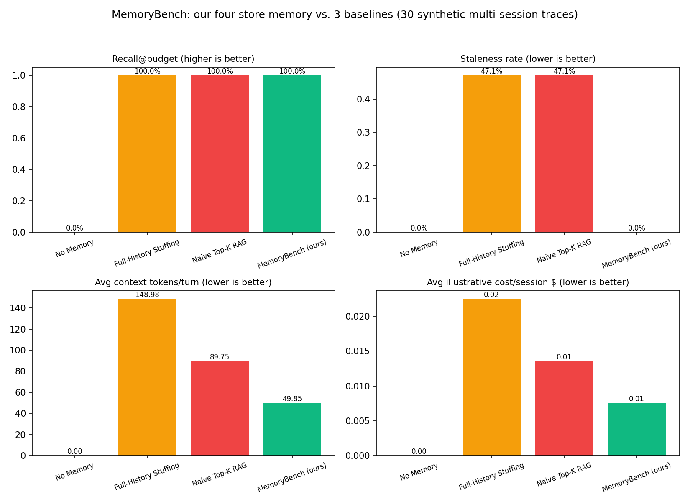
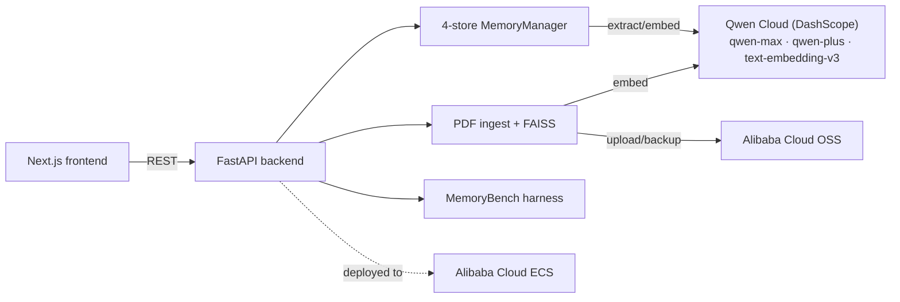

# MemoryBench

A four-store memory layer for LLM agents — episodic / semantic / preference /
working — with contradiction resolution (supersede, never silently append),
importance-and-recency decay (archive, never delete), and knapsack-based
budgeted retrieval (maximize relevance under a hard token budget, not
top-k). **MemoryBench** is the benchmark harness that proves it: 30 synthetic
multi-session traces, scored against no-memory, full-history-stuffing, and
naive top-k RAG baselines.

## MemoryBench results

30 synthetic multi-session traces with evolving user preferences and papers
that get corrected mid-trace. Same recall as the baselines that just keep
everything, **zero staleness** (vs. 47% for both raw-stuffing baselines) by
construction — superseded facts are excluded from the retrievable pool, not
merely deprioritized — at roughly a third of the token cost.



| Metric | No Memory | Full-History Stuffing | Naive Top-K RAG | MemoryBench (ours) |
|---|---|---|---|---|
| Recall@budget | 0.0% | 100.0% | 100.0% | **100.0%** |
| Staleness rate | 0.0% | 47.1% | 47.1% | **0.0%** |
| Avg context tokens/turn | 0 | 149 | 90 | **50** |
| Avg cost/session ($, illustrative) | 0.0000 | 0.0225 | 0.0136 | **0.0075** |
| Avg latency/turn (s, illustrative) | 0.050 | 0.139 | 0.104 | **0.080** |

Regenerate it yourself (offline, deterministic, no paid inference):

```bash
source .venv/bin/activate
python -m backend.bench.run --traces 30 --seed 42
```

Cost/latency figures are an illustrative model documented in
[`backend/bench/systems.py`](backend/bench/systems.py) (real published
DashScope pricing scaled by context-token count), not live billing calls —
see [`docs/submission.md`](docs/submission.md) for why.

## Architecture



Full diagram with component notes: [`docs/architecture.md`](docs/architecture.md).

## Setup

```bash
# backend
cd memorybench-research-workspace
python3.11 -m venv .venv && source .venv/bin/activate
pip install -r backend/requirements.txt
cp .env.example .env   # fill in DASHSCOPE_API_KEY / OSS_* to enable live inference + cloud storage
uvicorn backend.app:app --reload --port 8000

# tests
python -m pytest   # 32 tests: memory layer, bench harness, API, OSS integration — all mocked, no paid calls

# frontend (separate terminal)
cd frontend
cp .env.example .env.local
npm install
npm run dev   # http://localhost:3000
```

The app runs fully offline with zero configuration: without `DASHSCOPE_API_KEY`
it uses an extractive stub for chat and a hashed bag-of-words embedding
instead of `text-embedding-v3`; without OSS credentials, uploaded PDFs and
FAISS backups fall back to local disk. Every code path is the same either
way — see `backend/state.py`.

## Alibaba Cloud deployment proof

[`backend/alibaba_cloud.py`](backend/alibaba_cloud.py) is the only file that
calls the `oss2` SDK: it uploads ingested PDFs to an OSS bucket and backs up
each session's FAISS index there. ECS provisioning + systemd/nginx config is
in [`backend/deploy/`](backend/deploy/), walkthrough in
[`docs/deploy.md`](docs/deploy.md).

## Project layout

```
backend/
  memory/     four-store memory layer (the actual product)
  bench/      MemoryBench harness
  documents/  PDF ingest, chunking, FAISS
  routes/     FastAPI endpoints
  deploy/     ECS systemd + nginx config
  tests/      pytest — 32 tests, all cloud calls mocked
frontend/     Next.js UI — Chat / Memory Inspector / MemoryBench tabs
docs/         architecture, deploy guide, submission writeup
```

## Track

Track 1 (MemoryAgent) — Global AI Hackathon with Qwen Cloud. See
[`docs/submission.md`](docs/submission.md) for the full submission writeup.

## License

MIT — see [`LICENSE`](LICENSE).
