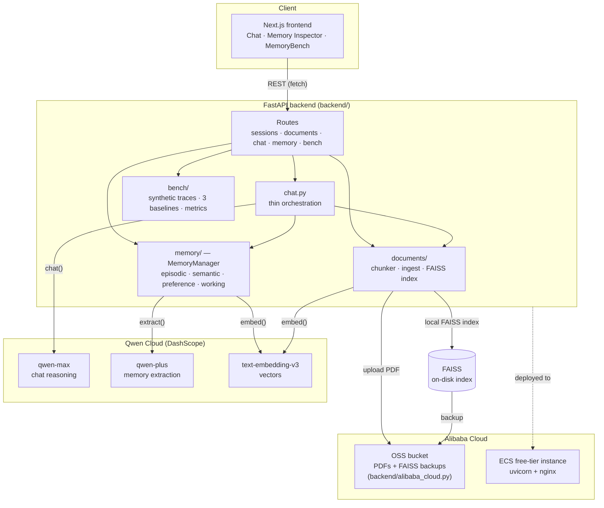

# Architecture

## Component notes

- **`backend/memory/`** — the four-store memory layer: `models.py` (record
  schema), `contradiction.py` (key-based supersession), `decay.py`
  (recency/access/importance scoring, archive-not-delete), `retrieval.py`
  (0/1 knapsack budgeted selection), `manager.py` (orchestrates all four),
  `stores.py` (thin per-store policy views).
- **`backend/bench/`** — MemoryBench: `traces.py` generates 30 synthetic
  multi-session users, `systems.py` implements the real memory system
  alongside three baselines, `metrics.py` + `report.py` score and chart them.
- **`backend/chat.py`** — deliberately thin: retrieve memory, retrieve
  document chunks, build context, call Qwen (or fall back to an offline
  extractive stub when `DASHSCOPE_API_KEY` isn't set), let the extractor
  decide what to persist.
- **`backend/alibaba_cloud.py`** — the Alibaba Cloud deployment proof; the
  only file that calls the `oss2` SDK. Falls back to local disk when OSS
  isn't configured so the whole app runs offline for dev/CI.
- **`frontend/`** — Next.js App Router, three tabs sharing one session id
  (persisted to `localStorage`), talking to the backend over plain `fetch`.

See [`docs/deploy.md`](deploy.md) for the ECS + OSS provisioning steps this
diagram's "Alibaba Cloud" box maps to.
